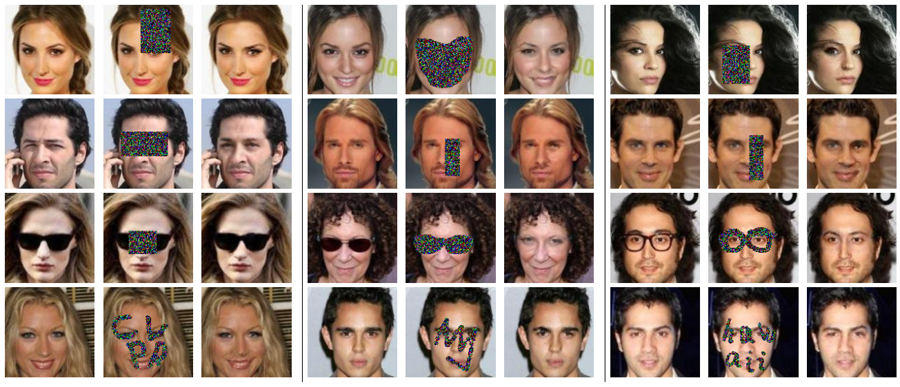

# [GenerativeFaceCompletion](https://sites.google.com/site/yijunlimaverick/facecompletion)
Matcaffe implementation of our CVPR17 [paper](http://openaccess.thecvf.com/content_cvpr_2017/papers/Li_Generative_Face_Completion_CVPR_2017_paper.pdf) on face completion.


In each panel from left to right: original face, masked input, completion result.

## Setup

- We use the [caffe-for-cudnn-v2.5.48](https://github.com/RadekSimkanic/caffe-for-cudnn-v2.5.48). Please refer [Caffe](http://caffe.berkeleyvision.org/installation.html) for more installation details.
- Basically, you need to first modify the [MATLAB_DIR](https://github.com/BVLC/caffe/issues/4510) in Makefile.config and then run the following commands for a successful compilation:
```
make all -j4
make matcaffe
```


## Testing
- Download our face completion model [Model_G](https://drive.google.com/open?id=0B8_MZ8a8aoSeQlNwY2pkRkVIVmM) and put it under ./matlab/FaceCompletion_testing/model/ folder. 
- Run ./matlab/FaceCompletion_testing/demo_face128.m for completion. TestImages are from the CelebA test dataset.

